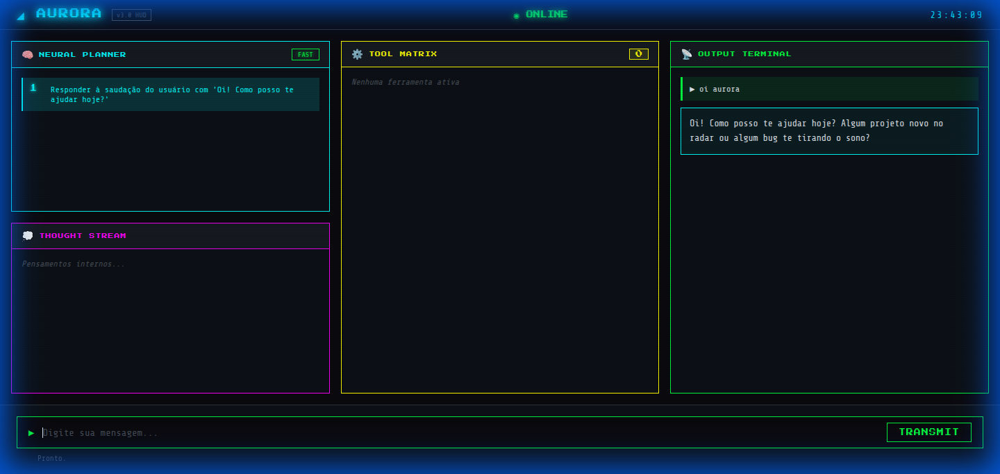

# Aurora Agent v0.9 🌌

> **O Agente de "Sistema 2": Cognição Profunda, Agendamento Neural e Autonomia Real.**

**Aurora** é um assistente pessoal autônomo de última geração, projetado não apenas para responder, mas para **pensar, agir e evoluir**. Diferente de chatbots convencionais, o Aurora utiliza uma arquitetura de "Processamento Profundo" (System 2), permitindo que ele decomponha tarefas complexas, crie suas próprias ferramentas e gerencie seu próprio tempo através de um agendador neural nativo.

---

## 🧠 Arquitetura Cognitiva: Brain & Voice

O Aurora opera com uma separação clara entre a capacidade de raciocínio lógico e a expressão da personalidade ("Soul"):

*   **The Brain (Gemini 3/Flash)**: O núcleo de alta performance responsável pelo planejamento multietapa, análise técnica e tomada de decisão crítica.
*   **The Voice (Groq/Llama 3)**: O módulo de interface humana que traduz as conclusões técnicas do "cérebro" em uma fala natural, empática e alinhada com a persona definida.

### O Fluxo de Pensamento
1.  **Perceive**: Captura o input (Texto/Visão) e recupera memórias semânticas relevantes.
2.  **Gatekeeper**: Decide instantaneamente entre *Fast Thinking* (Reflexivo) ou *Deep Thinking* (Raciocínio estruturado).
3.  **Think (System 2)**: Gera um plano de execução, critica o próprio plano e refina a estratégia antes de agir.
4.  **Act**: Executa ferramentas (Python, Shell, Web Search) de forma iterativa até atingir o objetivo.
5.  **Synthesize**: A "Voz" transforma o resultado técnico em uma resposta natural.
6.  **Schedule**: Se necessário, o Aurora agenda tarefas futuras para monitoramento ou execução autônoma.
7.  **Consolidate**: Durante o ciclo de "Sleep", padrões de sucesso são destilados para a memória de longo prazo.

---

## ⏰ Neural Scheduler (Auto-Invocação)

Um dos diferenciais da v0.9 é o **Relógio Interno**. O Aurora agora pode "acordar" sozinho para realizar tarefas agendadas em background.

-   **Self-Invocation**: Durante um processo de pensamento, o agente pode decidir: *"Vou verificar o status deste site daqui a 2 horas"*.
-   **Background Execution**: Tarefas agendadas rodam em instâncias isoladas, garantindo que processos longos não bloqueiem a interação principal do usuário.
-   **Notificações Telegram**: Resultados de tarefas em background são enviados diretamente para o seu celular assim que concluídos.

---

## 🖥️ Aurora HUD // Neural Interface

Uma interface Web imersiva com estética **Sci-Fi / Retro-Futurista** para monitoramento total do estado mental do agente.



O HUD é dividido em três centros de controle:
*   🧠 **Brain Tab**: Visualize o fluxo de pensamento, plano atual e execução de ferramentas em tempo real.
*   ⏰ **Scheduler Tab**: Gerencie tarefas pendentes, veja contagens regressivas e configure recorrências.
*   ⚡ **Instances Tab**: Monitore "clones" da Aurora que estão trabalhando em tarefas agendadas em background.

---

## 🛡️ Memória Resiliente e Aprendizado Contínuo

O Aurora nunca começa do zero. Seu sistema de memória é construído para ser à prova de falhas:
-   **Hybrid Vector Store**: Utiliza `ChromaDB` para busca semântica de alta precisão.
-   **Automatic Fallback**: Se o provedor de embeddings principal falhar, o sistema alterna instantaneamente para modelos locais `HuggingFace` otimizados para CPU.
-   **Ciclo de Consolidação**: Todas as interações diárias são processadas pelo script `scripts/run_sleep.py`, que extrai aprendizados e limpa ruídos, mantendo a "mente" do agente afiada.

---

## 🛠️ Instalação e Setup

### Pré-requisitos
*   Python 3.10+
*   Docker (Opcional, recomendado para deploy 24/7)

### Guia Rápido
1.  **Clone e Entre**:
    ```bash
    git clone https://github.com/ZarabaDev/aurora-agent.git
    cd aurora-agent
    ```
2.  **Ambiente Virtual**:
    ```bash
    python3 -m venv venv
    source venv/bin/activate
    pip install -r requirements.txt
    ```
3.  **Configuração**:
    Produza seu arquivo `.env` baseado no `.env.example`:
    ```bash
    cp .env.example .env
    ```
4.  **Inicie o Motor e o HUD**:
    ```bash
    # Em um terminal
    python web_server.py
    ```
    Acesse em: `http://localhost:5001`

---

## 📄 Licença
Este projeto é licenciado sob a MIT License - veja o arquivo [LICENSE](LICENSE) para detalhes.
